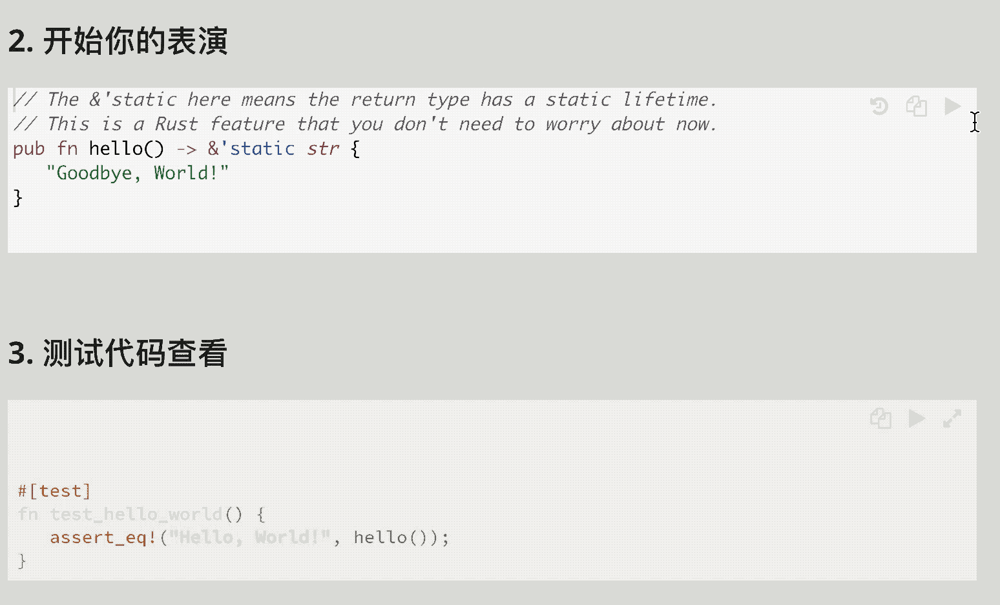

# exercism/rust [![translate-svg]][translate-list]

<!-- [![explain]][source]  -->

[explain]: http://llever.com/explain.svg
[source]: https://github.com/chinanf-boy/Source-Explain
[translate-svg]: http://llever.com/translate.svg
[translate-list]: https://github.com/chinanf-boy/chinese-translate-list

「 [exercism.io](exercism.io) 的 Rust 练习(网页版) 」

| 网页版                                                                                     |
| ------------------------------------------------------------------------------------------ |
| 答案测试已完成([工作进度](http://llever.com/exercism-rust-zh)), [mdBook 源文件-src](./src) |

> 要下载到本机，请看[原项目](https://github.com/exercism/rust)

[中文](./readme.md) | [english](https://github.com/exercism/rust)

---

## 校对 ✅

<!-- doc-templite START generated -->
<!-- repo = 'exercism/rust' -->
<!-- commit = 'a390d5d84b51507f04d6125979abe5e42a42e7ae' -->
<!-- time = '2018-11-04' -->

| 翻译的原文 | 与日期        | 最新更新 | 更多                       |
| ---------- | ------------- | -------- | -------------------------- |
| [commit]   | ⏰ 2018-11-04 | ![last]  | [中文翻译][translate-list] |

[last]: https://img.shields.io/github/last-commit/exercism/rust.svg
[commit]: https://github.com/exercism/rust/tree/a390d5d84b51507f04d6125979abe5e42a42e7ae

<!-- doc-templite END generated -->

- [x] [如有需要，请看入门](./exercises/hello-world/GETTING_STARTED.zh.md)
- [x] [目录](./src/SU)
- [x] [准备](./exercises/prepare.md) 每个练习都有一个帮你，准备的小节，(过于重复，我直接拿出来)
- [x] [./exercises](./exercises) 练习们
  - [x] [hello world](./exercises/hello-world/README.zh.md)
  - [x] [千兆秒 >< Gigasecond)](./exercises/gigasecond/README.zh.md)
  - [x] [闰年 >< Leap](./exercises/leap/README.zh.md)
  - [x] [雨滴声 >< Raindrops](./exercises/raindrops/README.zh.md)
  - [x] [反转字符串 >< Reverse String](./exercises/reverse-string/README.zh.md)
  - [x] [第 n 个素数 >< Nth Prime](./exercises/nth-prime/README.zh.md)
  - [x] [迟钝孩子 >< Bob](./exercises/bob/README.zh.md)
  - [x] [啤酒之歌 >< Beer Song](./exercises/beer-song/README.zh.md)
  - [x] [谚语串烧 >< Proverb](./exercises/proverb/README.zh.md)
  - [x] [平方差 >< Difference Of Squares](./exercises/difference-of-squares/README.zh.md)
  - [x] [倍数之和 >< Sum Of Multiples](./exercises/sum-of-multiples/README.zh.md)
  - [x] [谷物 >< Grains](./exercises/grains/README.zh.md)
  - [x] [勾股数 >< Pythagorean Triplet](./exercises/pythagorean-triplet/README.zh.md)
  - [x] [素数因子 >< Prime Factors](./exercises/prime-factors/README.zh.md)
  - [x] [子串 >< Series](./exercises/series/README.zh.md)
  - [x] [水仙花数 >< Armstrong Numbers](./exercises/armstrong-numbers/README.zh.md)
  - [x] [3n+1 猜想 >< Collatz Conjecture](./exercises/collatz-conjecture/README.zh.md)
  - [x] [迪菲-赫尔曼密钥交换 >< Diffie Hellman](./exercises/diffie-hellman/README.zh.md)
  - [x] [鞍点 >< Saddle Points](./exercises/saddle-points/README.zh.md)
  - [x] [等值线 >< Isogram](./exercises/isogram/README.zh.md)
  - [x] [英文说数字 >< Say](./exercises/say/README.zh.md)
  - [x] [游程编码 >< Run Length Encoding](./exercises/run-length-encoding/README.zh.md)
  - [x] [图书编号 >< ISBN Verifier](./exercises/isbn-verifier/README.zh.md)
  - [x] [数字也能分类 >< Perfect Numbers](./exercises/perfect-numbers/README.zh.md)
  - [x] [时钟 >< Clock](./exercises/clock/README.zh.md)
  - [x] [DOT DSL](./exercises/dot-dsl/README.zh.md)
  - [x] [汉明距离 >< Hamming](./exercises/hamming/README.zh.md)
  - [x] [简单链表 >< Simple Linked List](./exercises/simple-linked-list/README.zh.md)
  - [x] [杨辉三角形 >< Pascal's Triangle](./exercises/pascals-triangle/README.zh.md)
  - [x] [字母的分数游戏 >< Scrabble Score](./exercises/scrabble-score/README.zh.md)
  - [x] [全字母句 >< Pangram](./exercises/pangram/README.zh.md)
  - [x] [PaaS-IO-报告 >< Paasio](./exercises/paasio/README.zh.md)
  - [x] [核苷酸计数 >< Nucleotide Count](./exercises/nucleotide-count/README.zh.md)
  - [x] [模 10 算法 >< Luhn](./exercises/luhn/README.zh.md)
  - [x] [最大数字子串乘积 >< Largest Series Product](./exercises/largest-series-product/README.zh.md)
  - [x] [单词计数 >< Word Count](./exercises/word-count/README.zh.md)
  - [x] [Atbash 加密 >< Atbash Cipher](./exercises/atbash-cipher/README.zh.md)
  - [x] [密码矩形 >< Crypto Square](./exercises/crypto-square/README.zh.md)
  - [x] [旋转密码 >< Rotational Cipher](./exercises/rotational-cipher/README.zh.md)
  - [x] [简单加密 >< Simple Cipher](./exercises/simple-cipher/README.zh.md)
  - [x] [栅栏密码 >< Rail Fence Cipher](./exercises/rail-fence-cipher/README.zh.md)
  - [x] [ETL](./exercises/etl/README.zh.md)
  - [x] [集合操作 >< Accumulate](./exercises/accumulate/README.zh.md)
  - [x] [术语 >< Acronym](./exercises/acronym/README.zh.md)
  - [x] [素数筛 >< Sieve](./exercises/sieve/README.zh.md)
  - [x] [RNA 转录 >< RNA Transcription](./exercises/rna-transcription/README.zh.md)
  - [x] [三角形](./exercises/triangle/README.zh.md)
  - [x] [罗马数字 >< Roman Numerals](./exercises/roman-numerals/README.zh.md)
  - [x] [你所的基本](./exercises/all-your-base/README.zh.md)
  - [x] [学册](./exercises/grade-school/README.zh.md)
  - [x] [二分查找](./exercises/binary-search/README.zh.md)
  - [x] [机器人模拟器](./exercises/robot-simulator/README.zh.md)
  - [x] [括号配套](./exercises/bracket-push/README.zh.md)
  - [x] [Luhn From](./exercises/luhn-from/README.zh.md)
  - [x] [皇后 攻击](./exercises/queen-attack/README.zh.md)
  - [x] [保龄球](./exercises/bowling/README.zh.md)
  - [x] [子列表](./exercises/sublist/README.zh.md)
  - [x] [地球年](./exercises/space-age/README.zh.md)
  - [x] [Luhn Trait](./exercises/luhn-trait/README.zh.md)
  - [x] [宏](./exercises/macros/README.zh.md)
  - [x] [过敏](./exercises/allergies/README.zh.md)
  - [x] [可变长度数量](./exercises/variable-length-quantity/README.zh.md)
  - [x] [电话号码](./exercises/phone-number/README.zh.md)
  - [x] [罗唆](./exercises/wordy/README.zh.md)
  - [x] [比赛](./exercises/tournament/README.zh.md)
  - [x] [自定义 set](./exercises/custom-set/README.zh.md)
  - [x] [字母谜题](./exercises/alphametics/README.zh.md)
  - [x] [两个桶](./exercises/two-bucket/README.zh.md)
  - [x] [猪的拉丁文](./exercises/pig-latin/README.zh.md)
  - [x] [钻石](./exercises/diamond/README.zh.md)
  - [x] [螺旋矩阵](./exercises/spiral-matrix/README.zh.md)
  - [x] [回文产品](./exercises/palindrome-products/README.zh.md)
  - [x] [扑克](./exercises/poker/README.zh.md)
  - [x] [grep](./exercises/grep/README.zh.md)
  - [x] [音阶生成器](./exercises/scale-generator/README.zh.md)
  - [x] [十进制](./exercises/decimal/README.zh.md)
  - [x] [字谜](./exercises/anagram/README.zh.md)
  - [x] [蛋白质翻译](./exercises/protein-translation/README.zh.md)
  - [x] [机器人名称](./exercises/robot-name/README.zh.md)
  - [x] [书店](./exercises/book-store/README.zh.md)
  - [x] [OCR 号码](./exercises/ocr-numbers/README.zh.md)
  - [x] [扫雷](./exercises/minesweeper/README.zh.md)
  - [x] [骨牌](./exercises/dominoes/README.zh.md)
  - [x] [并行字母频率](./exercises/parallel-letter-frequency/README.zh.md)
  - [x] [矩形](./exercises/rectangles/README.zh.md)
  - [x] [Forth](./exercises/forth/README.zh.md)
  - [x] [循环缓冲区](./exercises/circular-buffer/README.zh.md)
  - [x] [React](./exercises/react/README.zh.md)
  - [x] [十六进制](./exercises/hexadecimal/README.zh.md)
  - [x] [核苷酸密码子](./exercises/nucleotide-codons/README.zh.md)
  - [x] [Two Fer](./exercises/two-fer/README.zh.md)

### 贡献

欢迎 👏 勘误/校对/更新贡献 😊 [具体贡献请看](https://github.com/chinanf-boy/chinese-translate-list#贡献)

## 生活

[If help, **buy** me coffee —— 营养跟不上了，给我来瓶营养快线吧! 💰](https://github.com/chinanf-boy/live-need-money)

---

本项目是 Rust 的 Exercism 练习的 Fork 版本，主要提供，由 mdBook 工具生成的静态网页版。

# Exercism Rust 轨道

